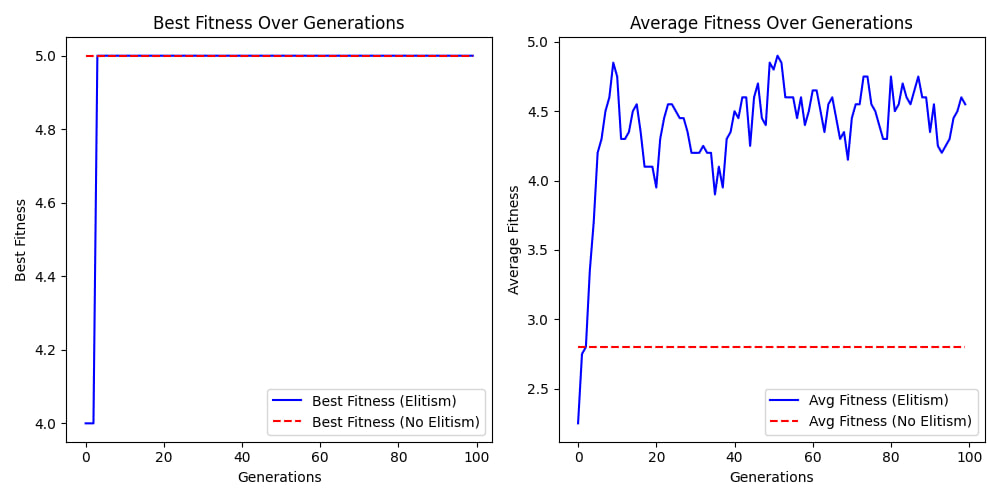

# Practical-Applications-of-Genetic-and-Ant-Colony-Optimization-Algorithms

This repository contains a series of optimization problem-solving practices using Genetic Algorithms (GA) and Ant Colony System (ACS). The work explores both discrete and continuous optimization using classic and advanced evolutionary techniques, offering visual insights into convergence behaviors and algorithmic effectiveness.

  

---

## Contents

- Binary Genetic Algorithm for OneMax Problem
-  Function Optimization with Binary Encoding (Standard vs Gray, Constraint Handling)
-  Real-Encoded GA with Gaussian Mutation and Tournament Selection
-  Ant Colony Optimization for the Traveling Salesman Problem (TSP)

---

## Practice 1: Binary Genetic Algorithm for OneMax Problem

A foundational GA implementation using binary strings of length 5:
- Fitness: Count of ones (aim: match target 11111)
- Selection: Roulette Wheel
- Operators: One-point Crossover, Bit-flip Mutation
- Visualization: Best & Average Fitness over 100 Generations
- Elitism: Top 2 individuals preserved per generation

  

---

## Practice 2: Function Optimization with Binary Encoding

Maximize the function:  
**F(x1, x2) = 8 – (x1 + 0.0317)² + (x2)²**,  
where -2 ≤ x1, x2 ≤ 2

- Population: 100 binary-encoded chromosomes
- Comparisons:
  - Standard vs Gray Code Encoding
  - Multiple Precision Levels (bit-depth)
- Constraint Handling:  
  - Add penalty: `F(x1, x2) - |x1 + x2 - 1|`
- Visualizations:
  - Fitness trajectories under various encoding strategies

  

  

---

## Practice 3: Real-Encoded GA with Tournament Selection

Enhanced real-value GA implementation:
- Real Encoding: Floating-point values in range [-2, 2]
- Crossover: Arithmetic Crossover
- Mutation: Gaussian (σ = 0.5)
- Selection: Tournament (k = 2 vs. large k comparison)
- Maintains Elitism: Top 2 preserved per generation

Goals:
- Compare performance of real vs. binary encoding
- Evaluate operator influence (selection, crossover, mutation)

  

  

---

## Practice 4: Ant Colony System for Traveling Salesman Problem (TSP)

- Solves TSP for 30 cities using ACS
- Initialization:
  - Distance and heuristic matrices
  - Initial pheromone levels (based on nearest neighbor heuristic)
- Iterative Tour Construction:
  - State Transition Rule
  - Pheromone Updates
- Hyperparameter Tuning:
  - Effect of α, β, and ρ
  - Suitable number of ants (m)
- Output: Shortest tours and city plotting

  

---

## 🔧 Tools and Libraries

- Python 
- NumPy
- Matplotlib
- Random / SciPy (for real encoding)

## License
**Copyright (c) 2025 Abdullah Elafifi**
